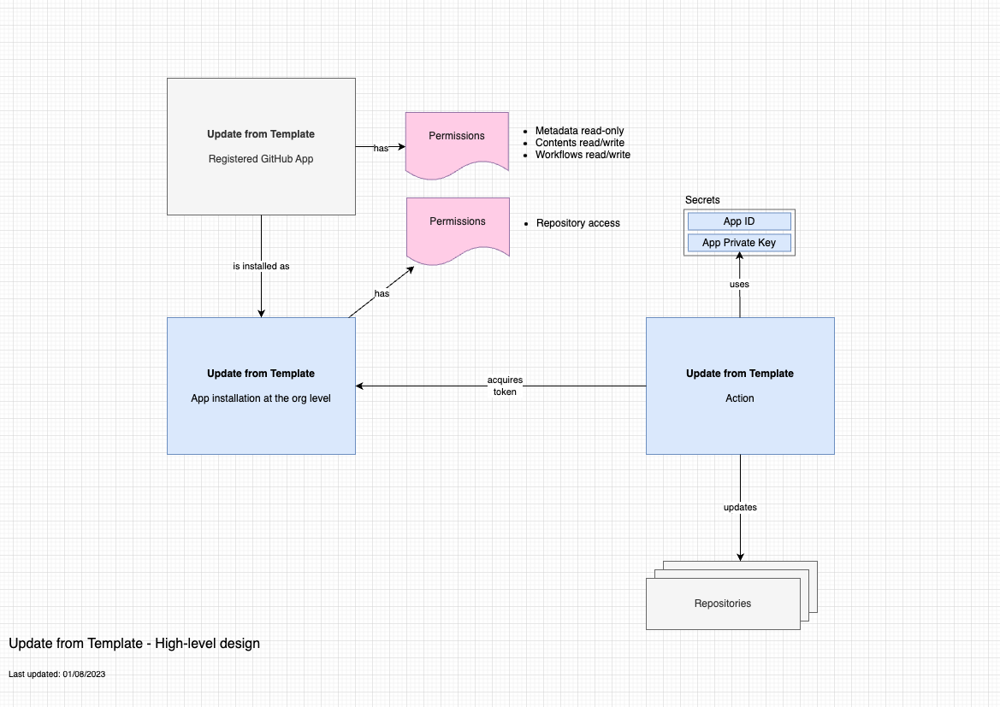

# Update from Template App

The Update from Template App is a powerful GitHub App and Action designed to propagate changes made in a template repository to all repositories created from it. This action is particularly beneficial for maintaining consistency across multiple repositories, which were initially set up using the [template repository](https://github.com/nhs-england-tools/repository-template) in the NHS England GitHub organisations. This ensures that improvements, fixes or any updates to the template repository are automatically synchronised across all linked repositories, enhancing maintainability, ensuring consistency and helping with governance.


## Table of Contents

- [Update from Template App](#update-from-template-app)
  - [Table of Contents](#table-of-contents)
  - [Installation](#installation)
    - [Prerequisites](#prerequisites)
  - [Usage](#usage)
  - [Architecture](#architecture)
    - [Diagrams](#diagrams)
    - [Configuration](#configuration)
  - [Contributing](#contributing)
  - [Contacts](#contacts)
  - [Licence](#licence)

## Installation

By including preferably a one-liner or if necessary a set of clear CLI instructions we improve user experience. This should be a frictionless installation process that works on various operating systems (macOS, Linux, Windows WSL) and handles all the dependencies.

Clone the repository

```shell
git clone https://github.com/nhs-england-tools/repository-template.git
cd nhs-england-tools/repository-template
```

Install and configure toolchain dependencies

```shell
make config
```

If this repository is

```shell
/bin/bash -c "$(curl -fsSL https://raw.githubusercontent.com/org/repo/branch/install.sh)"
```

### Prerequisites

The following software packages or their equivalents are expected to be installed

- [GNU make](https://www.gnu.org/software/make/)
- [Docker](https://www.docker.com/)

## Usage

After a successful installation, provide an informative example of how this project can be used. Additional code snippets, screenshots and demos work well in this space. You may also link to the other documentation resources, e.g. the [User Guide](./docs/user-guide.md) to demonstrate more use cases and to show more features.

Locally

```shell
make docker-build
make docker-test \
  REPOSITORY_TEMPLATE=github.com/nhs-england-tools/repository-template \
  BRANCH_NAME=main \
  REPOSITORY_TO_UPDATE=github.com/nhs-england-tools/update-from-template-app \
  GIT_USER_NAME="Update from Template App" \
  GIT_USER_EMAIL="update-from-template-app@users.noreply.github.com" \
  DRY_RUN=true \
  VERBOSE=false
```

## Architecture

### Diagrams

The [C4 model](https://c4model.com/) is a simple and intuitive way to create software architecture diagrams that are clear, consistent, scalable and most importantly collaborative. This should result in documenting all the system interfaces, external dependencies and integration points.



### Configuration

Most of the projects are built with customisability and extendability in mind. At a minimum, this can be achieved by implementing service level configuration options and settings. The intention of this section is to show how this can be used. If the system processes data, you could mention here for example how the input is prepared for testing - anonymised, synthetic or live data.

GitHub secret variables

- `UPDATE_FROM_TEMPLATE_GH_APP_ID`: GitHub App ID
- `UPDATE_FROM_TEMPLATE_GH_APP_PK`: GitHub App private key
- `UPDATE_FROM_TEMPLATE_GH_APP_SK_ID`: GitHub App commit signing key ID, this belongs to a bot account
- `UPDATE_FROM_TEMPLATE_GH_APP_SK_CONTENT`: GitHub App commit signing key content, this belongs to a bot account
- `UPDATE_FROM_TEMPLATE_GH_APP_SK_PASSPHRASE`: GitHub App commit signing key passphrase, this belongs to a bot account

## Contributing

Describe or link templates on how to raise an issue, feature request or make a contribution to the codebase. Reference the other documentation files, like

- Environment setup for contribution, i.e. `CONTRIBUTING.md`
- Coding standards, branching, linting, practices for development and testing
- Release process, versioning, changelog
- Backlog, board, roadmap, ways of working
- High-level requirements, guiding principles, decision records, etc.

## Contacts

- [Dan Stefaniuk](https://github.com/stefaniuk)

## Licence

> The [LICENCE.md](./LICENCE.md) file will need to be updated with the correct year and owner

Unless stated otherwise, the codebase is released under the MIT License. This covers both the codebase and any sample code in the documentation.

Any HTML or Markdown documentation is [© Crown Copyright](https://www.nationalarchives.gov.uk/information-management/re-using-public-sector-information/uk-government-licensing-framework/crown-copyright/) and available under the terms of the [Open Government Licence v3.0](https://www.nationalarchives.gov.uk/doc/open-government-licence/version/3/).
